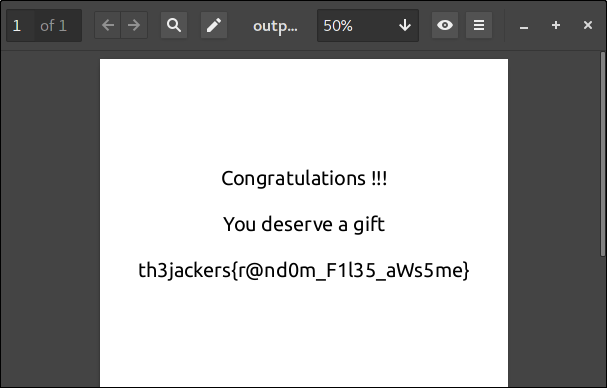

# HimayaTicQuals2017 - FOR200 WriteUp
## Challenge details
|       Event        | Challenge | Category | Points  |
|:-------------------|:----------|:---------|:-------:|
| HimayaTicQuals2017 |FOR200     | Forensic |200      |

### Description
> An Ex-CIA Agent, is aware that government know lot about him.  
> So to hide an important file , he had to be very careful.  
> As CIA Agent, your job is to find the hidden file.
> they say it contains top secret informations.
### Attachments
> It'll be uploaded as soon as possible
## First Steps
After I downloaded the 124MB zip file, I checked if it's a real zip file or not
```bash
$ file FOR200.zip
FOR200.zip: Zip archive data, at least v2.0 to extract
```
So it's a real zip file
```bash
$ unzip FOR200.zip
Archive:  FOR200.zip
  inflating: FOR200
```
It contains only one file `FOR200`,
checking with `file` again:
```bash
$ file FOR200
FOR200: ISO 9660 CD-ROM filesystem data 'CDROM'
```
The `FOR200` file seems to be a CDROM image,
let's extract it and see its content
```bash
$ 7z x FOR200.iso -oCDROM_IMAGE

7-Zip [64] 16.02 : Copyright (c) 1999-2016 Igor Pavlov : 2016-05-21
p7zip Version 16.02 (locale=en_US.UTF-8,Utf16=on,HugeFiles=on,64 bits,4 CPUs Intel(R) Core(TM) i3-4005U CPU @ 1.70GHz (40651),ASM,AES-NI)

Scanning the drive for archives:
1 file, 145874944 bytes (140 MiB)

Extracting archive: FOR200.iso
--
Path = FOR200.iso
Type = Iso
Physical Size = 145874944
Comment =
System: LINUX
Volume: CDROM
Application: GENISOIMAGE ISO 9660/HFS FILESYSTEM CREATOR (C) 1993 E.YOUNGDALE (C) 1997-2006 J.PEARSON/J.SCHILLING (C) 2006-2007 CDRKIT TEAM
Created = 2016-07-11 02:12:08
Modified = 2016-07-11 02:12:08

Everything is Ok                                  

Folders: 735
Files: 14860
Size:       128365261
Compressed: 145874944
```
> WoW 735 folders and 14860 files  
> We have a really big mess to deal with
```bash
$ cd CDROM_IMAGE/
$ ll
-rw-r--r--  1 philomath213 philomath213 8.9K Jul 11  2016 2JKZI1TJ.ZIP
drwx------  7 philomath213 philomath213 4.0K Jul 11  2016 2XBP6O
-rw-r--r--  1 philomath213 philomath213 6.6K Jul 11  2016 39WEDIO0.SH
drwx------  7 philomath213 philomath213 4.0K Jul 11  2016 3Y6Y7OR
drwx------  8 philomath213 philomath213 4.0K Jul 11  2016 7UPDKO
drwx------  8 philomath213 philomath213 4.0K Jul 11  2016 A2KC6W8
-rw-r--r--  1 philomath213 philomath213  18K Jul 11  2016 AAY0O_PF.HTM
-rw-r--r--  1 philomath213 philomath213  12K Jul 11  2016 BVT4VEVK.JPG
-rw-r--r--  1 philomath213 philomath213  11K Jul 11  2016 C9Q2YAFW.RAR
drwx------  8 philomath213 philomath213 4.0K Jul 11  2016 CDDWJYGM
drwx------ 10 philomath213 philomath213 4.0K Jul 11  2016 D3KCGA78
-rw-r--r--  1 philomath213 philomath213  11K Jul 11  2016 DPVS73LF.MP3
drwx------  7 philomath213 philomath213 4.0K Jul 11  2016 EMKTDVZD
drwx------  8 philomath213 philomath213 4.0K Jul 11  2016 F4ETA61M
-rw-r--r--  1 philomath213 philomath213  11K Jul 11  2016 FLODRWMU.PDF
drwx------  7 philomath213 philomath213 4.0K Jul 11  2016 FRWX1A
-rw-r--r--  1 philomath213 philomath213 6.1K Jul 11  2016 FTGFLK4R.PNG
-rw-r--r--  1 philomath213 philomath213 2.5K Jul 11  2016 FY_TA0VZ.HTM
-rw-r--r--  1 philomath213 philomath213 3.3K Jul 11  2016 GA7L0ZZQ.JPG
-rw-r--r--  1 philomath213 philomath213 2.0K Jul 11  2016 HFBBVZ0B.SH
drwx------  9 philomath213 philomath213 4.0K Jul 11  2016 I46HSP
-rw-r--r--  1 philomath213 philomath213  14K Jul 11  2016 JDTAZ5KJ.AVI
-rw-r--r--  1 philomath213 philomath213 5.9K Jul 11  2016 JMMCKG9.ZIP
drwx------  8 philomath213 philomath213 4.0K Jul 11  2016 JWWBU7YY
-rw-r--r--  1 philomath213 philomath213 6.6K Jul 11  2016 JYZKHW3N.AVI
-rw-r--r--  1 philomath213 philomath213 3.7K Jul 11  2016 K1JBYDGX.RAR
-rw-r--r--  1 philomath213 philomath213  15K Jul 11  2016 LRPLY0OS.SH
-rw-r--r--  1 philomath213 philomath213 1.3K Jul 11  2016 _LS9P13V.AVI
-rw-r--r--  1 philomath213 philomath213 8.2K Jul 11  2016 LV7FOYJJ.AVI
-rw-r--r--  1 philomath213 philomath213 9.8K Jul 11  2016 MZW9IPWT.PHP
-rw-r--r--  1 philomath213 philomath213  15K Jul 11  2016 NGF0NEDD.SH
-rw-r--r--  1 philomath213 philomath213 9.5K Jul 11  2016 NKI0GKXM.MP3
-rw-r--r--  1 philomath213 philomath213 3.3K Jul 11  2016 NUUUQIBP.PHP
drwx------  7 philomath213 philomath213 4.0K Jul 11  2016 NVORPE
-rw-r--r--  1 philomath213 philomath213  10K Jul 11  2016 NX5T9XXP.ZIP
-rw-r--r--  1 philomath213 philomath213 2.5K Jul 11  2016 O7RCAKWW.HTM
-rw-r--r--  1 philomath213 philomath213 4.6K Jul 11  2016 O8U2CF8G.PY
-rw-r--r--  1 philomath213 philomath213 4.6K Jul 11  2016 OPJAPITC.TXT
-rw-r--r--  1 philomath213 philomath213 3.0K Jul 11  2016 Q3PXYMTT.RAR
-rw-r--r--  1 philomath213 philomath213  14K Jul 11  2016 QESCD_QT.AVI
-rw-r--r--  1 philomath213 philomath213  17K Jul 11  2016 QKSUU1O3.ZIP
-rw-r--r--  1 philomath213 philomath213 9.4K Jul 11  2016 QMSE2XI_.PHP
-rw-r--r--  1 philomath213 philomath213 1.4K Jul 11  2016 SWCNQ3_E.PDF
-rw-r--r--  1 philomath213 philomath213 6.0K Jul 11  2016 T2LD_FAU.JPG
-rw-r--r--  1 philomath213 philomath213  12K Jul 11  2016 T5VM9M7Z.RAR
-rw-r--r--  1 philomath213 philomath213 9.7K Jul 11  2016 T9EBXCEJ.PNG
-rw-r--r--  1 philomath213 philomath213 7.0K Jul 11  2016 TA1EQNEW.PDF
-rw-r--r--  1 philomath213 philomath213 8.3K Jul 11  2016 TM_NNNM.PY
-rw-r--r--  1 philomath213 philomath213 4.7K Jul 11  2016 TUMS6WYD.HTM
drwx------  7 philomath213 philomath213 4.0K Jul 11  2016 UJ_CCTIN
drwx------  7 philomath213 philomath213 4.0K Jul 11  2016 WEN3UMSD
-rw-r--r--  1 philomath213 philomath213  15K Jul 11  2016 WG1B99W3.PNG
-rw-r--r--  1 philomath213 philomath213 6.0K Jul 11  2016 X1EWAMHH.TXT
drwx------  9 philomath213 philomath213 4.0K Jul 11  2016 X3DPITUJ
drwx------ 10 philomath213 philomath213 4.0K Jul 11  2016 XPYDMM
drwx------  7 philomath213 philomath213 4.0K Jul 11  2016 YBDSAM
```
The files consist of a dozen of files type `*.SH`, `*.PY`, `*.TXT`, `*.HTML`, `*.PHP`, `*.ZIP`, `*.PDF` ...
## Some Hard Work:
I used `file` again to check these files
```bash
$ file *
2JKZI1TJ.ZIP: data
2XBP6O:       directory
39WEDIO0.SH:  data
3Y6Y7OR:      directory
7UPDKO:       directory
A2KC6W8:      directory
AAY0O_PF.HTM: data
BVT4VEVK.JPG: data
C9Q2YAFW.RAR: data
CDDWJYGM:     directory
D3KCGA78:     directory
DPVS73LF.MP3: data
EMKTDVZD:     directory
F4ETA61M:     directory
FLODRWMU.PDF: data
FRWX1A:       directory
FTGFLK4R.PNG: data
FY_TA0VZ.HTM: SysEx File - Fender
GA7L0ZZQ.JPG: data
HFBBVZ0B.SH:  data
I46HSP:       directory
JDTAZ5KJ.AVI: data
JMMCKG9.ZIP:  data
JWWBU7YY:     directory
JYZKHW3N.AVI: data
K1JBYDGX.RAR: data
LRPLY0OS.SH:  data
_LS9P13V.AVI: data
LV7FOYJJ.AVI: data
MZW9IPWT.PHP: data
NGF0NEDD.SH:  data
NKI0GKXM.MP3: data
NUUUQIBP.PHP: data
NVORPE:       directory
NX5T9XXP.ZIP: data
O7RCAKWW.HTM: data
O8U2CF8G.PY:  data
OPJAPITC.TXT: data
Q3PXYMTT.RAR: data
QESCD_QT.AVI: data
QKSUU1O3.ZIP: data
QMSE2XI_.PHP: data
SWCNQ3_E.PDF: data
T2LD_FAU.JPG: Dyalog APL component file 32-bit level 1 journaled non-checksummed version 177.58
T5VM9M7Z.RAR: data
T9EBXCEJ.PNG: data
TA1EQNEW.PDF: data
TM_NNNM.PY:   data
TUMS6WYD.HTM: data
UJ_CCTIN:     directory
WEN3UMSD:     directory
WG1B99W3.PNG: data
X1EWAMHH.TXT: data
X3DPITUJ:     directory
XPYDMM:       directory
YBDSAM:       directory
```
Okay, most of them are `data`.  
They look like an encrypted files or maybe just `/dev/urandom` garbage.  
This is a forensic task, and the description said that there is a hidden file so let's just assume they are random files.    
We have 735 folders and 14860 files, and we are looking for something special which  we don't know how it look like.  
If we search deep maybe we will find some real files  
We need to filter these files by ignoring the `data` files, or just search for some  scripts or images.  
I like scripts so I started with shell scripts.  
I noticed that all the files names are in upper case.  
I used `find` to fetch all the files with `*.SH` extension and passed them to `file` through `xargs`, in order to check them if they are real shell script or not.  
And of course we need `grep` and regular expression to filter the output.  
```bash
$ find -iname "*.SH" | xargs file | grep -i ".*\(bash\|script\|shell\)"
```
I got nothing, there are no shell script here  
The next target was Python scripts  
I found one and only one script, this is looking good
```bash
$ find -iname "*.PY" | xargs file | grep -i ".*\(python\|script\|text\|ascii\)"
./EMKTDVZD/DVCLP/KWLYLZ/FJ3ORXEG.PY:      Python script, ASCII text executable
```

```python
#!/usr/bin/python2
from itertools import cycle,islice
def encrypt(message,key):
    key=''.join(islice(cycle(key),len(message)))
    res=''.join([chr(ord(message[i]) ^ ord(key[i])) for i in range(len(message))])
    return res
f=open("3j5tXf0froBY3dLKlu.pdf","rb")
msg=f.read()
kf=open("ES91orh9Xi890t66.txt","rb")
k3y=kf.read().replace('\n','')
out=open("output.pdf","wb")
out.write(encrypt(msg,k3y))
out.close()
kf.close()
f.close()
```
After a little  analyzing I found that the script open two files and read them in binary mode `"rb"` and finaly XOR the `pdf` file with the key in the `txt`.  
#####The two files are:
* 3j5tXf0froBY3dLKlu.pdf
* ES91orh9Xi890t66.txt

`encrypt(message,key)` function is just a simple `XOR`  
The `txt` is the key and the `pdf` file is the plaintext  
The `itertools` used to iterate the key and make it as long as the length of the plaintext  
## Stage Two:
The next step is finding these two files  
I used the two files names written in the python script in order to find the key and the XORed pdf file, but that was not too simple
```bash
find -name "3j5tXf0froBY3dLKlu.pdf"
```
```bash
find -name "ES91orh9Xi890t66.txt"
```
I found nothing  
I ignored the case sensitivity (`-iname`) and neither this helped me   
The files names was totally random and either there content    
But they were all upper case and have the same width `8` + the width of the extension  
So I just used the first 8 characters for each file name
```bash
$ find -iname "`echo '3j5tXf0froBY3dLKlu.pdf' | head -c 8`*"
./NVORPE/M4JW0FOY/EESYQUY3/3YPR4M/3J5TXF0F.PDF
```
```bash
$ find -iname "`echo 'ES91orh9Xi890t66.txt' | head -c 8`*"
./CDDWJYGM/JZDSNVAI/DHEACD9N/SDFDF34G/ES91ORH9.TXT
```
Finally I got what I want   
## Wind Up:
Now I have the key and the encrypted file  
All what's left to do is to decrypt the pdf file using the key in the text file  
Since the encryption algorithm is `Symetric` and `Bijective` I used the same script to decrypt the pdf file, I just renamed the files to there original names and put all these 3 files in one folder  
```bash
$ mkdir flag
$ mv CDDWJYGM/JZDSNVAI/DHEACD9N/SDFDF34G/ES91ORH9.TXT flag/ES91orh9Xi890t66.txt
$ mv NVORPE/M4JW0FOY/EESYQUY3/3YPR4M/3J5TXF0F.PDF flag/3j5tXf0froBY3dLKlu.pdf
$ mv EMKTDVZD/DVCLP/KWLYLZ/FJ3ORXEG.PY flag/
$ cd flag
$ chmod +x FJ3ORXEG.PY
$ ./FJ3ORXEG.PY
```
The decrypted file was `output.pdf`  
The flag was a plaintext in the pdf file
#####th3jackers{r@nd0m_F1l35_aWs5me}

